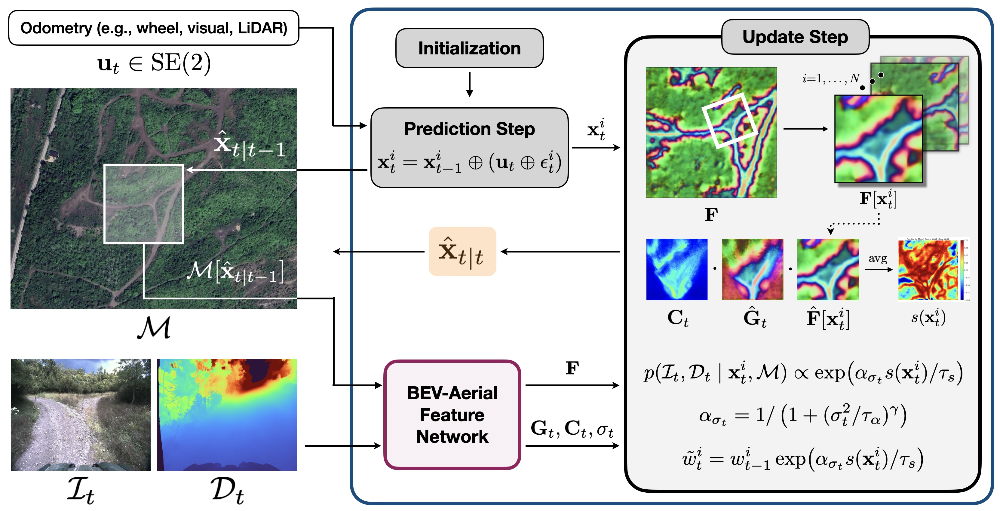

<div align="center">

# BEV-Patch-PF

**Particle Filtering with BEV-Aerial Feature Matching for Off-Road Geo-Localization**

[Project Page](https://amrl.cs.utexas.edu/bev-patch-pf) • [Paper (arXiv)](https://arxiv.org/abs/2512.15111) • [ROS 2 Deployment](https://github.com/ut-amrl/bev-patch-pf_ROS2)

</div>

<p align="center">
  
</p>

BEV-Patch-PF is a GPS-free geo-localization system for long-horizon offroad localization.
It combines learned bird's-eye-view (BEV) features, aerial map features, and particle filtering to estimate robot pose over time.


## Installation

```bash
conda create -y -n bev-patch-pf python=3.12
conda activate bev-patch-pf
conda install -y -c conda-forge manifpy
pip install -e .
```

For multi-GPU training with `accelerate`:

```bash
pip install accelerate
```

## Quick Start

### Demo

The demo downloads a pinned checkpoint and a pinned sparse demo dataset from Hugging Face, then launches Rerun with the demo blueprint.

```bash
python src/run_demo.py
```

The demo configuration is defined in [`config/demo.yaml`](config/demo.yaml).

### Particle Filter Evaluation

Run offline particle filtering with a local checkpoint:

```bash
python src/run_pf.py sequence=tartandrive ckpt_path=/path/to/model.pth
```

`run_pf.py` uses [`config/run_pf.yaml`](config/run_pf.yaml) together with sequence configs under [`config/sequence`](config/sequence).

## Training

Single-GPU training:

```bash
python src/train.py
```

Multi-GPU training:

```bash
accelerate launch --multi_gpu --num_processes=<num_gpus> --mixed_precision=fp16 src/train_ddp.py
```

The default training setup is defined in [`config/train.yaml`](config/train.yaml). Training outputs are written under `output/train/...`.


`export_onnx.py` exports the model components, runs `onnx.checker.check_model`, and performs parity checks against PyTorch.

## Real-Time Deployment

After exporting ONNX, build TensorRT engines and run the ROS 2 deployment stack from the companion repository:
[ut-amrl/bev-patch-pf_ROS2](https://github.com/ut-amrl/bev-patch-pf_ROS2)

### Export ONNX

Export the model for deployment:

```bash
python scripts/export_onnx.py --ckpt_path=/path/to/model.pth --out_dir=/path/to/export_dir
```

## Dataset Preparation

### From ROS Bagfiles

A typical pipeline is:

1. Extract sensor streams such as RGB, depth, and IMU using [`rosbagkit`](https://github.com/ut-amrl/rosbagkit).
2. Generate a trajectory estimate with a SLAM or odometry pipeline (e.g., FAST-LIO, Adaptive-LIO).
3. Export a GeoTIFF map in the correct UTM zone (e.g., QGIS).
4. Align the trajectory into the GeoTIFF frame:

```bash
python preprocessing/align_trajectory_geotiff.py --geotiff=/path/to/map.tiff --traj=/path/to/trajectory.csv
```

5. Run dataset-specific preprocessing as needed, for example:

```bash
python preprocessing/preprocess_arl_jackal.py
```

### From TartanDrive 2.0

1. Download the raw bagfiles from https://github.com/castacks/tartan_drive_2.0.
2. Extract images and odometry with [`rosbagkit`](https://github.com/ut-amrl/rosbagkit).
3. Run preprocessing:

```bash
python preprocessing/preprocess_tartandrive.py
```

## Citation

```bibtex
@misc{lee2025bevpatchpf,
  title         = {BEV-Patch-PF: Particle Filtering with BEV-Aerial Feature Matching for Off-Road Geo-Localization},
  author        = {Lee, Dongmyeong and Quattrociocchi, Jesse and Ellis, Christian and Rana, Rwik and Adkins, Amanda and Uccello, Adam and Warnell, Garrett and Biswas, Joydeep},
  year          = {2025},
  eprint        = {2512.15111},
  archivePrefix = {arXiv},
  primaryClass  = {cs.RO}
}
```
